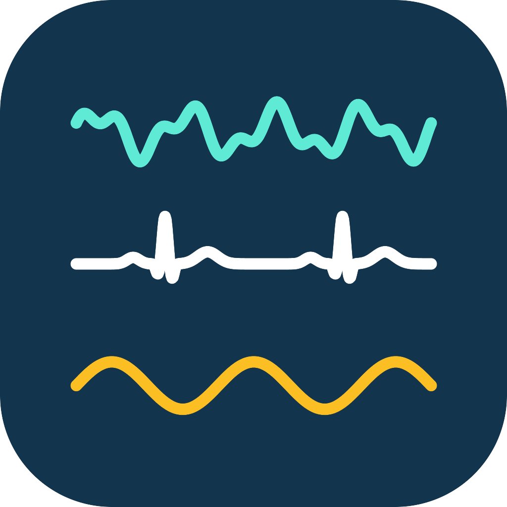

# liblsl.dart: Lab Streaming Layer for Dart and Flutter, XDF reader and LSL Viewer

[](https://github.com/invertase/melos) [](https://github.com/NexusDynamic/liblsl.dart/actions/workflows/test.yml)

Dart and Flutter tools for [Lab Streaming Layer](https://labstreaminglayer.org)
(LSL) and [XDF](https://github.com/sccn/xdf/wiki/Specifications) recordings:
the `liblsl` bindings, a pure-Dart XDF reader and writer, and **LSL Viewer**, an
XDF file viewer and LSL stream viewer for desktop, Android and the web.

## LSL Viewer: XDF file viewer and LSL stream viewer



- **Open XDF files** (LabRecorder recordings) of any size, one tab per
  stream, in the browser (read locally, never uploaded) or on the desktop.
- **View live LSL streams** with filters, re-referencing, power spectra,
  signal quality and trigger decoding.
- **Record** LSL streams to XDF, and **replay** XDF recordings as LSL
  streams.
- **Share LSL over the network:** a WebSocket bridge and relay, so browsers
  can view and publish streams, and streams can cross networks multicast
  doesn't reach.
- OpenBCI Cyton and serial devices, including over WebSerial in the browser.

**[Open the web app](https://nexusdynamic.org/liblsl.dart/lsl_viewer/)** ·
**[Downloads for Windows, macOS, Linux and Android](https://github.com/NexusDynamic/liblsl.dart/releases?q=lsl_viewer&expanded=true)**
(`lsl_viewer <version>` releases; desktop archives include the `lsl` command
line tool) · [Website](https://nexusdynamic.org/liblsl.dart/) ·
[Bridge and relay setup guide](./packages/lsl_tools/doc/relay.md) ·
[Source](./apps/lsl_viewer)

## Packages

| Package | What it is |
| --- | --- |
| [liblsl](./packages/liblsl) [](https://pub.dev/packages/liblsl) [](https://joss.theoj.org/papers/2d813b551058e59edacefd35ea281e40) [](https://doi.org/10.5281/zenodo.20340247) | Dart/Flutter bindings for liblsl, with full parity with the C library ([JOSS paper](./packages/liblsl/paper/paper.md)) |
| [xdf](./packages/xdf) [](https://pub.dev/packages/xdf) | Read and write XDF files in pure Dart (all platforms, including the web); pyxdf's algorithms, tested against pyxdf |
| [signal_core](./packages/signal_core) [](https://pub.dev/packages/signal_core) | Format-agnostic multichannel signal engine (summary pyramids, filters) behind the viewer and `xdf` |
| [lsl_tools](./packages/lsl_tools) | Record to XDF, the WebSocket bridge/relay, test outlets, and the `lsl` command line tool |
| [lsl_viewer](./apps/lsl_viewer) | The LSL Viewer app, built from `signal_viewer` and its `_lsl`, `_xdf` and `_serial` source providers |
| [liblsl_test](./packages/liblsl_test) | Integration tests to try liblsl with Flutter on any platform |
| [liblsl_timing](./packages/liblsl_timing) / [liblsl_analysis](./packages/liblsl_analysis) | Multi-device latency, sync and timing tests, and their analysis |
| [peer_coordinator](./packages/peer_coordinator), [liblsl_coordinator](./packages/liblsl_coordinator), [webrtc_coordinator](./packages/webrtc_coordinator) | Coordinating experiments across devices (LSL, WebSocket hub, WebRTC) |

## Getting Started

You're most likely interested in the [liblsl](./packages/liblsl) package, which is the main package for liblsl.dart. You can find installation instructions and usage examples in the [README](./packages/liblsl/README.md) of that package. API documentation, and the Dart package are available on pub.dev: [https://pub.dev/packages/liblsl](https://pub.dev/packages/liblsl).

### Working with the monorepo

This is a monorepo managed with [melos](https://melos.invertase.dev/~melos-latest) and [fvm](https://fvm.app/). To get started, clone this repository *including submodules*:

```bash
git clone --recurse-submodules
```

[Install fvm](https://fvm.app/documentation/getting-started/installation), then run:

```bash
cd liblsl.dart
fvm dart pub get
```

There are some helpful melos commands for working with the monorepo:

- `fvm exec melos run <script>`: run a script defined in the `melos` `scripts` section of the root `pubspec.yaml` across all packages. For example, `melos run format` runs `dart format .` in all packages.
- `fvm exec melos run lint:all`: run `dart analyze` and `dart format` for all packages, and fail if there are any warnings or formatting issues.
- `fvm exec melos run test`: run `dart test` for all packages.

The lint and test scripts at the very least should be run before pushing any changes. For more scripts available, see the [pubspec.yaml](./pubspec.yaml) file.

## Contributing

See the [CONTRIBUTING.md](./CONTRIBUTING.md) file for guidelines on how to contribute to this project.

## Code of Conduct

This project and everyone participating in it must uphold [Code of Conduct](./CODE_OF_CONDUCT.md). By participating, you are expected to uphold this code.

## Support

Please see the [SUPPORT.md](./SUPPORT.md) file for information on how to get support for liblsl.dart and where to ask questions or discuss potential features.

[
](https://matrix.to/#/#NexusDynamic:neuro.wang)

## Security

Please see the [SECURITY.md](./SECURITY.md) file for information on how to report security vulnerabilities for liblsl.dart.

## License

This project is licensed under the MIT License - see the [LICENSE](./LICENSE) file for details.
