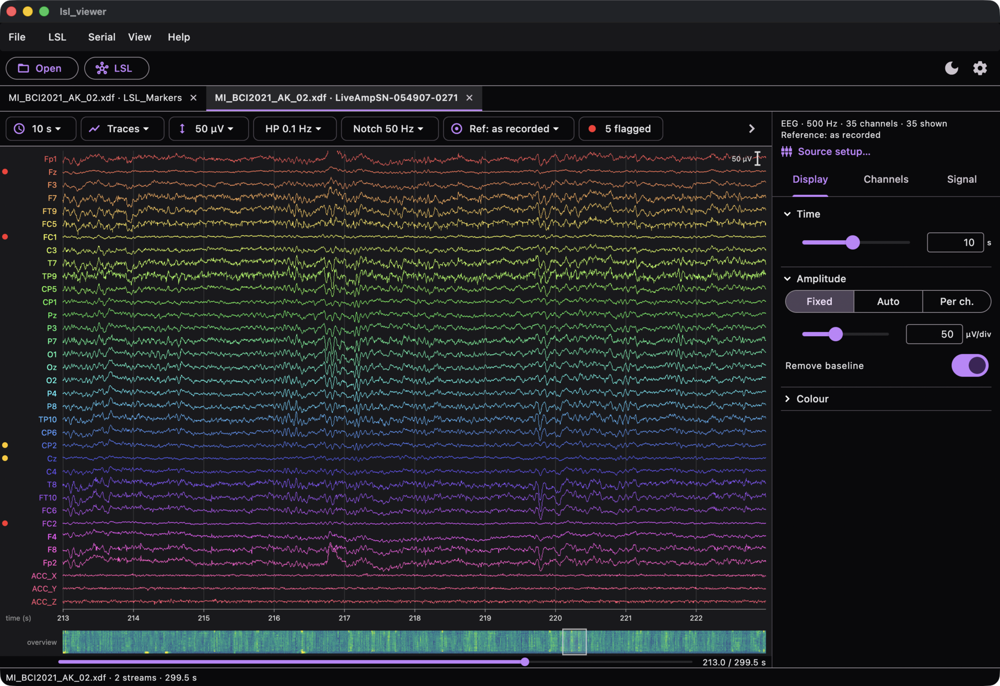
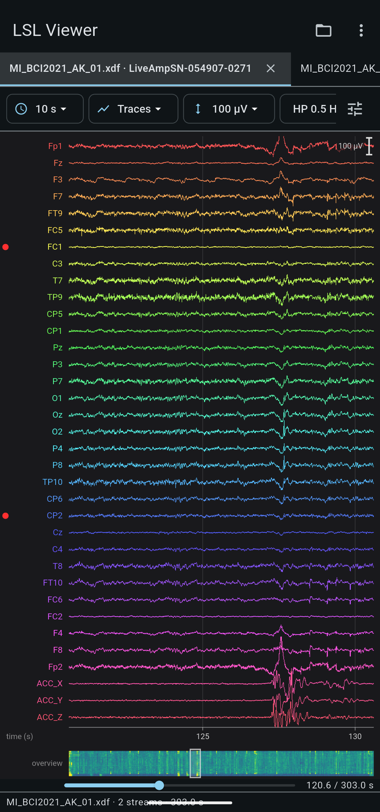

# liblsl.dart: Lab Streaming Layer for Dart and Flutter, XDF reader and LSL Viewer

[](https://github.com/invertase/melos) [](https://github.com/NexusDynamic/liblsl.dart/actions/workflows/test.yml)

This repository contains Dart and Flutter libraries and applications for
[Lab Streaming Layer](https://labstreaminglayer.org) (LSL), networked
multimodal data collection, the coordination of multiple devices in
experiments, and [XDF](https://github.com/sccn/xdf/wiki/Specifications)
recordings.

The LSL Viewer application displays XDF recordings and live LSL streams from
any source. `transport_timing` is a cross-platform validation and
measurement tool for characterising the transmission timing (latency)
between devices. Its recorded measurements are loaded into
`transport_timing_analysis`, which collates and visualises the results from
all the devices involved in a test. Applications are distributed as
downloads and, where applicable, as web apps.

The core `liblsl` package provides a Dart interface to the C++ `liblsl`
library. `peer_coordinator` coordinates multiple devices in an experiment,
including starting and stopping data streams on all devices together, and
`liblsl_coordinator` carries that coordination over LSL. The `xdf` package
is a pure-Dart implementation of the XDF file format for reading and writing
recordings. All libraries are published on pub.dev.

## Guides

| Guide | Result |
| --- | --- |
| [Streaming data between two devices](./docs/streaming-between-devices.md) | A stream of timestamped samples sent from one device and received on another |
| [A coordinated experiment](./docs/coordinated-experiment.md) | Several devices running one program, in which a coordinator starts a data stream on all of them and announces trials |
| [Validating timing in a lab](./docs/validating-timing.md) | Measured latency, jitter, loss and clock drift between the devices of a lab |
| [Sharing LSL streams over the network](./packages/lsl_tools/doc/relay.md) | LSL streams available in web browsers and across networks |

## Viewing recordings and streams

LSL Viewer displays XDF recordings, such as those written by LabRecorder, and
live LSL streams on Windows, macOS, Linux, Android and the web. Recordings of
any size open with one tab per stream; in the web app, files are read locally
in the browser. Live streams can be filtered and re-referenced, and are shown
with power spectra, signal quality measures and decoded triggers. Streams can
be recorded to XDF, and recordings can be replayed as LSL streams. A
WebSocket bridge and relay make LSL streams available to browsers and across
networks that multicast does not reach. OpenBCI Cyton boards and other serial
devices are supported, including through WebSerial in the browser.

**[Web app](https://nexusdynamic.org/liblsl.dart/lsl_viewer/)** ·
**[Download 0.2.0](https://github.com/NexusDynamic/liblsl.dart/releases/tag/lsl_viewer-v0.2.0)**
(Windows, macOS, Linux, Android) ·
[Website](https://nexusdynamic.org/liblsl.dart/) ·
[Bridge and relay guide](./packages/lsl_tools/doc/relay.md) ·
[Source](./apps/lsl_viewer)

<p align="center">
    <a href="lsl_and_xdf_viewer_screenshot.png">
        
    </a>
    <a href="android_lsl_and_xdf_viewer.png">
        
    </a>
</p>

| Name | Type | Description | Get it |
| --- | --- | --- | --- |
| [lsl_viewer](./apps/lsl_viewer) | application | Viewer for XDF recordings and live LSL streams | [web app](https://nexusdynamic.org/liblsl.dart/lsl_viewer/) · [0.2.0](https://github.com/NexusDynamic/liblsl.dart/releases/tag/lsl_viewer-v0.2.0) |
| [signal_viewer](./packages/signal_viewer) | library | Flutter viewer for multichannel signals, with pluggable source providers | [](https://pub.dev/packages/signal_viewer) |
| [signal_viewer_lsl](./packages/signal_viewer_lsl) | library | Source provider for LSL streams | [](https://pub.dev/packages/signal_viewer_lsl) |
| [signal_viewer_xdf](./packages/signal_viewer_xdf) | library | Source provider for XDF recordings | [](https://pub.dev/packages/signal_viewer_xdf) |
| [signal_viewer_serial](./packages/signal_viewer_serial) | library | Source provider for serial devices, including WebSerial | [](https://pub.dev/packages/signal_viewer_serial) |
| [signal_core](./packages/signal_core) | library | Format-agnostic multichannel signal engine: summary pyramids, display filters, re-referencing and channel quality | [](https://pub.dev/packages/signal_core) |

Releases of the applications in this repository provide builds for Windows,
macOS, Linux and Android. The desktop archives of `lsl_viewer` include the
`lsl` command line tool. The macOS builds are unsigned and are opened the
first time through the context menu (right-click, *Open*).

## Streaming and recording data

| Name | Type | Description | Get it |
| --- | --- | --- | --- |
| [liblsl](./packages/liblsl) | library | Dart and Flutter interface to the C++ `liblsl` library, with full parity with the C API ([JOSS paper](./packages/liblsl/paper/paper.md), [benchmark history](https://nexusdynamic.org/liblsl.dart/dev/bench/)) | [](https://pub.dev/packages/liblsl) [](https://joss.theoj.org/papers/2d813b551058e59edacefd35ea281e40) [](https://doi.org/10.5281/zenodo.20340247) |
| [lsl_tools](./packages/lsl_tools) | library | Recording to XDF, the WebSocket bridge and relay, test outlets, and the `lsl` command line tool | [](https://pub.dev/packages/lsl_tools) |
| [xdf](./packages/xdf) | library | Reader and writer for XDF files in pure Dart, on all platforms including the web. Implements the algorithms of pyxdf and is tested against it | [](https://pub.dev/packages/xdf) |

`liblsl` is added to a project with `dart pub add liblsl`. Installation
notes and usage examples are in the
[package README](./packages/liblsl/README.md).

## Coordinating devices in an experiment

| Name | Type | Description | Get it |
| --- | --- | --- | --- |
| [peer_coordinator](./packages/peer_coordinator) | library | Transport-neutral coordination of devices: election of a coordinator, membership, heartbeat and synchronised data streams | [](https://pub.dev/packages/peer_coordinator) |
| [liblsl_coordinator](./packages/liblsl_coordinator) | library | LSL transport for `peer_coordinator` | [](https://pub.dev/packages/liblsl_coordinator) |
| [webrtc_coordinator](./packages/webrtc_coordinator) | library | Peer-to-peer WebRTC transport for `peer_coordinator` | [](https://pub.dev/packages/webrtc_coordinator) |
| [webrtc_coordinator_flutter](./packages/webrtc_coordinator_flutter) | library | `flutter_webrtc` binding for `webrtc_coordinator` | [](https://pub.dev/packages/webrtc_coordinator_flutter) |

## Validating timing

| Name | Type | Description | Get it |
| --- | --- | --- | --- |
| [transport_timing](./apps/transport_timing) | application | Measures one-way latency, jitter, loss and clock drift between devices over LSL, WebSocket and WebRTC | [2.0.0](https://github.com/NexusDynamic/liblsl.dart/releases/tag/transport_timing-v2.0.0) |
| [transport_timing_analysis](./apps/transport_timing_analysis) | application | Collates and visualises the run logs written by `transport_timing` | [web app](https://nexusdynamic.org/liblsl.dart/transport_timing_analysis/) · [2.0.0](https://github.com/NexusDynamic/liblsl.dart/releases/tag/transport_timing_analysis-v2.0.0) |
| [timing_core](./packages/timing_core) | library | Record format and analysis for transport timing runs | [](https://pub.dev/packages/timing_core) |
| [liblsl_test](./apps/liblsl_test) | application | Test application for `liblsl` with Flutter on each platform | [1.1.1](https://github.com/NexusDynamic/liblsl.dart/releases/tag/liblsl_test-v1.1.1) |

## Devices

| Name | Type | Description | Get it |
| --- | --- | --- | --- |
| [openbci_cyton](./packages/openbci_cyton) | library | OpenBCI Cyton and Cyton + Daisy boards over the USB dongle: commands, channel settings and samples in µV | [](https://pub.dev/packages/openbci_cyton) |
| [serial_transport](./packages/serial_transport) | library | Multi-platform serial port transport | [](https://pub.dev/packages/serial_transport) |

## Development

The repository is a monorepo managed with
[melos](https://melos.invertase.dev/~melos-latest) and
[fvm](https://fvm.app/). It is cloned with its submodules:

```bash
git clone --recurse-submodules https://github.com/NexusDynamic/liblsl.dart.git
cd liblsl.dart
fvm dart pub get
```

Scripts defined in the `melos` section of the root
[pubspec.yaml](./pubspec.yaml) run across all packages:

```bash
fvm exec melos run lint:all   # dart analyze and dart format; fails on warnings
fvm exec melos run test       # dart test in every package
```

Both are expected to pass before changes are pushed.

## Contributing and support

Contribution guidelines are in [CONTRIBUTING.md](./CONTRIBUTING.md), and
participants are expected to uphold the
[Code of Conduct](./CODE_OF_CONDUCT.md). [SUPPORT.md](./SUPPORT.md) describes
where to ask questions and discuss features. Security vulnerabilities are
reported as described in [SECURITY.md](./SECURITY.md).

[
](https://matrix.to/#/#NexusDynamic:neuro.wang)

## License

This project is licensed under the MIT License; see [LICENSE](./LICENSE).
