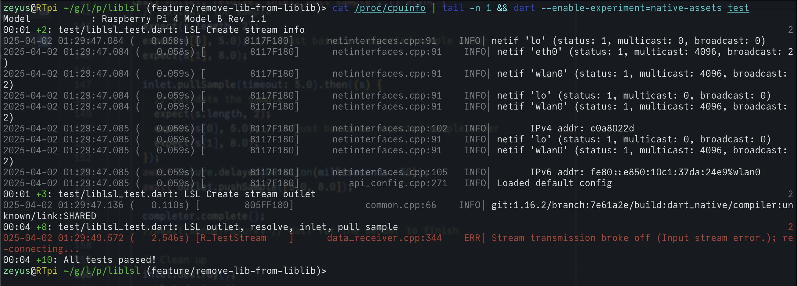

# liblsl dart Lab Streaming Layer (LSL) library

[](https://pub.dev/publishers/zeyus.com/packages) [](https://pub.dev/packages/liblsl) [](https://github.com/invertase/melos) [](https://github.com/NexusDynamic/liblsl.dart/actions/workflows/test.yml)

This package provides a Dart wrapper for liblsl, using the dart native-assets build system and ffi.


## Targets

- [x] Linux
- [x] OSX
- [x] Windows
- [x] iOS
- [x] Android
- [ ] Web - Possibly in the future, see: [`native_assets_cli` build.dart / link.dart web backends and WasmCode and JsCode assets](https://github.com/dart-lang/native/issues/988)

Also confirmed working on:

 - Meta Quest 2 (Android).
 - Raspberry Pi 4 (Linux/Raspberry Pi OS), only dart tested so far:
   
   `sudo apt update && sudo apt install build-essential clang llvm`
   
   `dart --enable-experiment=native-assets test`
   
   

## Introduction

The Lab Streaming Layer (LSL) is a system for streaming time series data, such as EEG or other physiological signals. It allows for real-time data sharing between different applications and devices.

LSL handles the heavy lifting of synchronizing data streams and managing the timing and drift correction of data. This can apply to time-critical real-time data, but can also be used to manipulate the data and pass it on to another stream or application.

You're not limited to EEG, LSL is used in all kinds of instrumentation, and you can also use it for non-frequent data streams, such as events or triggers, or even just passing messages and states between devices and applications. You can also use it to send message streams to a central logging server.

There's no need to go over all the details of LSL here, check out the excellent documentation for [LSL](https://labstreaminglayer.readthedocs.io/) and more information about [liblsl](https://labstreaminglayer.readthedocs.io/dev/app_dev.html#).

### Why this Dart package?

This package is a wrapper around the C++ liblsl library, allowing you to use LSL in your Dart applications. It uses the dart native-assets build system to compile the C++ code into a shared library that can be used in Dart.

What this means is that with very little effort, you can have bidirectional communcations in your Dart application on any supported platform, and can easily integrate it with any other LSL-enabled application or device.

### Flutter

This package will work with flutter without any issues, for an example see the [liblsl_test](../liblsl_test) package, which demonstrates an integration test that works on your device.

## Important notes

### Inlets and outlets

By design, this library uses Dart [isolates](https://dart.dev/language/isolates) to create an independent thread for each inlet and outlet. This means that you can have multiple inlets and outlets running at the same time, and the performance should remain high as there is no blocking of the main isolate. That said, once the number of streams goes beyond your system's number of CPU cores, it is possible that performance may degrade at some point. If you encounter any issues with performance, please let me know.

### Multicast

LSL uses multicast UDP packets to discover communicate between devices and applications. Multicast packets may be blocked on various managed switches and routers, or by your network or machine firewall. If you are having issues with LSL, check your network settings and firewall settings to ensure that multicast packets are allowed, the method to do this varies by platform and network infrastructure.

### No multicast? No problem!

It is possible to use LSL without multicast, this requires understanding your network infrastructure and the IP addresses of the devices you communicate with. The library provides a way to configure the LSL API, which *must* be called before invoking any other LSL functions. For further information, refer to the [LSL configuration files](https://labstreaminglayer.readthedocs.io/info/lslapicfg.html) page of the LSL documentation.

```dart
import 'package:liblsl/liblsl.dart';
/// Configure LSL to run in an enviroment that does not support
/// multicast. Devices that participat in the LSL network must have
/// their IP addresses manually specified, and this configuration
/// needs to be applied on all devices.
final apiConfig = LSLApiConfig(
    knownPeers: [
        '10.0.0.100',
        '10.0.0.100',
    ],
);
LSL.setConfigContent(apiConfig);

// Now you can continue as normal
```

### Android

Your application will require the `INTERNET`, `CHANGE_WIFI_MULTICAST_STATE`, `ACCESS_NETWORK_STATE`, and `ACCESS_WIFI_STATE` permissions in your `AndroidManifest.xml` file. This is required for multicast UDP communication, which is used by LSL.

```xml
<manifest xmlns:android="http://schemas.android.com/apk/res/android">
    <!-- ... other AndroidManifest.xml nodes -->
    <uses-permission android:name="android.permission.CHANGE_WIFI_MULTICAST_STATE" />
    <uses-permission android:name="android.permission.INTERNET"/>
    <uses-permission android:name="android.permission.ACCESS_NETWORK_STATE"/>
    <uses-permission android:name="android.permission.ACCESS_WIFI_STATE"/>
</manifest>
```

### iOS

There's a very unfortunate situation in iOS where you cannot access multicast networking without the special entitlement [`com.apple.developer.networking.multicast`](https://developer.apple.com/documentation/bundleresources/entitlements/com.apple.developer.networking.multicast). This is a special entitlement that is only available to Apple developers with a paid developer account, and by explicit request. If you don't have this entitlement, you will not be able to use LSL on iOS, and unfortunately, there's not much I can do about this. If you have a developer account, see the above entitlement documentation, and then visit the [Multicast Networking Entitlement Request page](https://developer.apple.com/contact/request/networking-multicast).

You will also need the following configured in your `Info.plist` file:

```xml
<?xml version="1.0" encoding="UTF-8"?>
<!DOCTYPE plist PUBLIC "-//Apple//DTD PLIST 1.0//EN" "http://www.apple.com/DTDs/PropertyList-1.0.dtd">
<plist version="1.0">
<dict>
    <!-- ... other Info.plist nodes -->
    <key>NSBonjourServices</key>
	<array>
		<string>liblsl._tcp</string>
		<string>liblsl._udp</string>
	</array>
    <key>NSLocalNetworkUsageDescription</key>
	<string>Allow LSL to find other devices and communicate</string>
</dict>
</plist>
```


## API Usage

More documentation will come, but see [liblsl_example.dart](./example/liblsl_example.dart), [liblsl_test.dart](./test/liblsl_test.dart) also see the [liblsl_test](https://github.com/NexusDynamic/liblsl.dart/tree/main/packages/liblsl_test) package for a working example with flutter for all supported target devices.

```dart
import 'package:liblsl/liblsl.dart';

// Create a stream info
final info = await LSL.createStreamInfo(
  streamName: 'MyStream',
  streamType: 'EEG',
  channelCount: 8,
  nominalSrate: 100.0,
  channelFormat: ChannelFormat.float32,
  sourceId: 'EEGSystem',
);

// Create a stream outlet to send data
final outlet = await LSL.createOutlet(
    streamInfo: info,
    chunkSize: 0,
    maxBuffer: 1
);

// throws an exception if no consumer is found (e.g. lab recorder)
await outlet.waitForConsumer(timeout: 5.0);

// send a sample to the outlet
final sample = List<double>.filled(8, 0.0);

await outlet.pushSample(sample);

// To receive data, a stream inlet is needed,
// this should be from a resolved stream, although
// you could technically create it manually

// find max 1 of all availble streams
final streams = await LSL.resolveStreams(
    waitTime: 1.0,
    maxStreams: 1,
);

// create an inlet for the first stream
final inlet = await LSL.createInlet(streamInfo: streams[0]);

// get the sample
final sample = await inlet.pullSample();

// do something with the values
print('Sample: ${sample[0]}, timesatamp: ${sample.timestamp}');

// clear the streaminfos
streams.destroy();

// clear up memory from inlet, outlet, resolver, etc
inlet.destroy();
outlet.destroy();


```

## Direct FFI usage

If you want to use the FFI directly, you can do so by importing the `native_liblsl.dart` file.

```dart
import 'package:liblsl/native_liblsl.dart';
// Create a simple stream info
final streamNamePtr = "TestStream".toNativeUtf8().cast<Char>();
final streamTypePtr = "EEG".toNativeUtf8().cast<Char>();
final sourceIdPtr = "TestSource".toNativeUtf8().cast<Char>();

final streamInfo = lsl_create_streaminfo(
    streamNamePtr,
    streamTypePtr,
    1, // One channel
    100.0, // 100Hz sample rate
    lsl_channel_format_t.cft_string, // String format
    sourceIdPtr,
);

// Create outlet
final outlet = lsl_create_outlet(streamInfo, 0, 1);

// Create a string sample (as an array of strings)
final sampleStr = "Test Sample".toNativeUtf8().cast<Char>();
final stringArray = malloc<Pointer<Char>>(1);
stringArray[0] = sampleStr;

// Push the sample
final result = lsl_push_sample_str(outlet, stringArray);

// Assert the result
expect(result, 0); // 0 typically means success

// Clean up
lsl_destroy_outlet(outlet);
lsl_destroy_streaminfo(streamInfo);
streamNamePtr.free();
streamTypePtr.free();
sourceIdPtr.free();
sampleStr.free();
stringArray.free();
```

## Testing

Currently (September 2025), the native assets are branch blocked so you will need to use flutter / dart "main" or beta channel to work with this lib for development purposes.

```bash
dart --enable-experiment=native-assets test
```

## Contributing

1. Fork the repository
2. Create a feature branch (`git checkout -b feature/amazing-feature`)
3. Commit your changes (`git commit -m 'Add amazing feature'`)
4. Push to the branch (`git push origin feature/amazing-feature`)
5. Open a Pull Request

### Development Guidelines

- Follow Dart's [effective dart](https://dart.dev/guides/language/effective-dart) style guide.
- Write tests for new features and bug fixes.
- Ensure all tests pass before submitting a pull request.

# License

This project is licensed under the MIT License - see the [LICENSE](./LICENSE) file for details.

# Acknowledgments

- [Christian A. Kothe: liblsl](https://github.com/sccn/liblsl) for the LSL library
- The [Dart programming language](https://dart.dev/) by Google
